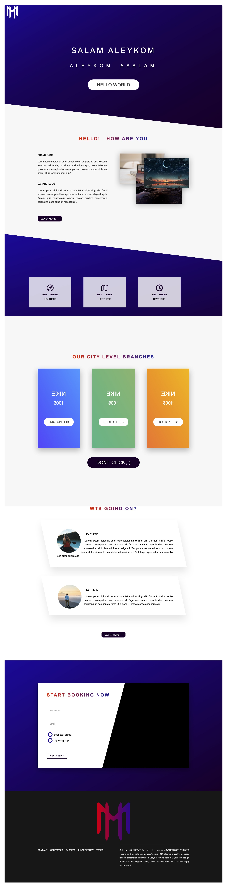

# Responsive Web Template

A clean and responsive HTML/CSS template for product or landing pages.  
Designed to be lightweight, mobile-friendly, and easy to customize.

---

## 📸 Preview



---

## ✨ Features
- Fully responsive layout for desktop and mobile
- Clean and semantic HTML structure
- Simple CSS styling, easy to customize
- Lightweight — no external frameworks required

---

## 🚀 How to Use
1. Clone this repository:  
   ```bash
   git clone https://github.com/amanda-taheri/responsive-web-template.git
